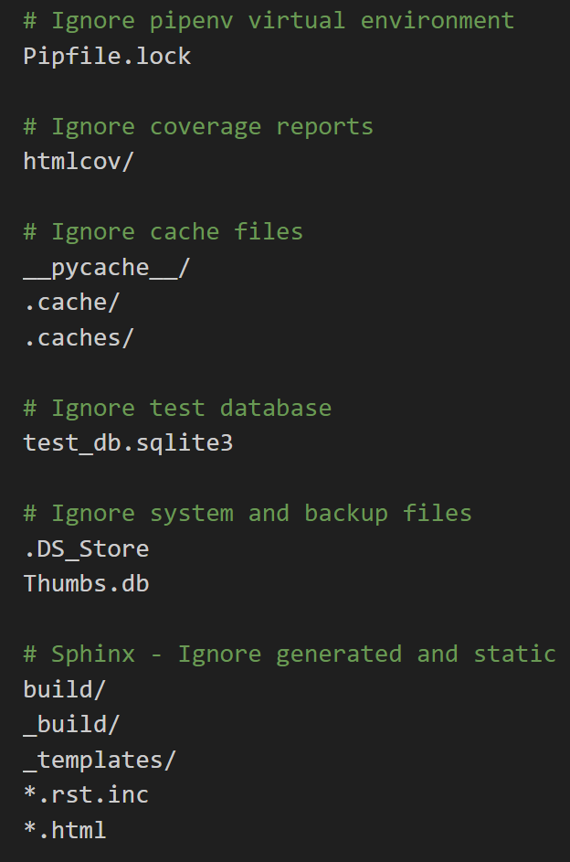

.. _FeaturesForDevelopers:

Features for Developers
--------------------------

.. contents:: Table of Contents

Quality-Driven Development / Developer Accessibility
=====================================================

Metrics
~~~~~~~~

From the Workflow / CI pipeline         |Build and Test|

- **Test Coverage**: |CodeCov|
- **Documentation Coverage**: |Sphinx Coverage Report|
- **Linting Report**: |PyLint|
- **Code Quality Ratings**: |CodeFactor|

.. |Build and Test| image:: https://github.com/Niloth-p/glitch-guru/actions/workflows/build_and_test.yml/badge.svg
   :target: https://github.com/Niloth-p/glitch-guru/actions/workflows/build_and_test.yml
.. |CodeFactor| image:: https://www.codefactor.io/repository/github/niloth-p/glitch-guru/badge
   :target: https://www.codefactor.io/repository/github/niloth-p/glitch-guru
.. |CodeCov| image:: https://codecov.io/github/Niloth-p/glitch-guru/graph/badge.svg?token=JOUMACX7QM
    :target: https://codecov.io/github/Niloth-p/glitch-guru
.. |PyLint| image:: https://mperlet.github.io/pybadge/badges/9.5.svg
    :target: https://github.com/Niloth-p/glitch-guru/actions/
.. |Sphinx Coverage Report| image:: https://img.shields.io/badge/sphinx--coverage-100%25-blue?style=plastic
   :target: #

Code Quality 
~~~~~~~~~~~~~~~

Modularization
**************

To illustrate our modularity approach, here are some examples of how we've implemented it in our project:

- **Configurability**: We have engineered our project such that even changing the project name is as simple as modifying a single line of code within `constants.py`. 
    - That's it! No need for changes in multiple code files.
    - No hardcoded values anywhere
    - Well, it's got tons of mentions in the documentation though :p

- **Module Organization**: The organization of our code into distinct modules is clearly defined. You can refer to the :ref:`DirectoryTree` page for an in-depth look at how the codebase is structured.

- **Dependency Management**: Pipenv file handles the dependency management

- **Clean Commit History**: We maintain a clean and modular `Commit History`_. Each commit is focused on specific features, bug fixes, or improvements, and the commit messages follow the conventional standards. This ensures that changes are well-documented, making it easier to track the evolution of the project over time.

.. _Commit History: https://github.com/Niloth-p/glitch-guru/commits/main

Error Handling
***************

- **Forms**: Our error handling strategy encompasses form submissions, where we anticipate and address potential errors that users may encounter. This proactive approach ensures a smoother user experience.

- **Input Validation**: Input validation is a fundamental part of our error handling process. We implement rigorous input validation techniques across our application, covering all potential edge cases, to prevent invalid data from causing errors.

Testing & Automation
~~~~~~~~~~~~~~~~~~~~~

|Build and Test| 

- **Unit Testing**: We conduct unit tests to validate individual components of our codebase, ensuring that they function as expected.

- **GitHub Actions Workflows**: We utilize GitHub Actions Workflows to automate our continuous integration (CI) process. This workflow includes running automated tests upon code commits.

- **GitHub Secrets Management**: Sensitive information, such as API keys and passwords, is securely managed using GitHub Secrets within our workflow.

- **User Testing on PythonAnywhere**: PythonAnywhere is instrumental for user testing, allowing us to gather valuable feedback from real users.

- **Screenshotting for Responsiveness Testing**: A custom script is used for capturing screenshots, aiding in UI display and testing responsiveness.

- **Data Population with Fixtures**: We employ fixtures to populate our database with predefined data, facilitating testing and development tasks.

- **Django Debug Toolbar**: The Django Debug Toolbar helps us monitor and optimize our application's performance during development.

- **Test Coverage Reports**: |CodeCov| Test coverage reports ensure that we maintain comprehensive test coverage across our codebase. 

Scripts for Automation
~~~~~~~~~~~~~~~~~~~~~~~

This section explores various scripts that automate frequent tasks, streamlining our workflow and enhancing productivity.

- **Screenshot Automation**: For UI display and testing responsiveness, we have developed a dedicated script that captures screenshots of browser screens of various sizes, making it easier to visually inspect and ensure the quality of our user interface.

- **Tree Generation Script**: To maintain a well-organized project structure, we utilize a script for generating directory trees. This script aids in keeping our project hierarchy clear and structured.

- **Deployment Automation**: Deploying our project on PythonAnywhere is made effortless with a specialized script. It simplifies the process of releasing updates and maintaining our online presence.

- **Backup Script**: Our PythonAnywhere environment is crucial, and to ensure its safety, we employ a backup script. This script automates the backup process, safeguarding our development environment and data.

Documentation
~~~~~~~~~~~~~~

|Sphinx Coverage Report|

The hardest part of development for most developers is writing the documentation. But it is also the most important resource for an open source community.

In our project, we employ tools such as ReadTheDocs and Sphinx to offer a range of essential documentation features to our users. These features are carefully designed to ensure that our documentation is user-friendly, comprehensive, and easily accessible. Key documentation features include:

- **Hosting on ReadTheDocs**: We host our documentation on the ReadTheDocs platform, ensuring it is readily available and accessible to users and developers. ReadTheDocs provides powerful features such as a robus search functionality.
- **Version Control**: Our documentation is version-controlled, enabling users to access documentation specific to the version of the platform they are using.
- **Sphinx Integration**: We seamlessly integrate Sphinx, a powerful documentation generator, which is especially well-suited for Django documentation.
- **Comprehensive Documentation**:
    - **User Guide**: A user-friendly guide offers clear and concise instructions for effective platform usage.
    - **Technical Documentation**: In-depth technical documentation delves into the inner workings of our platform.
    - **Developer Guide**: A comprehensive resource is available for developers, offering insights on the setup and development.
    - **Contributing Documentation**: We guide potential contributors through the process of contributing to our repo.
    - **Coverage Statistics**: We provide coverage statistics to help users and developers gauge the extent and comprehensiveness of our code quality, testing and documentation.
    - **The Codebase**: We provide complete detailed documentation for the codebase - all modules, functions and classes, in the form of docstrings.

    As an example, even our .gitignore file is quite elegantly documented.

:ref:`Back to Top <FeaturesForDevelopers>`
