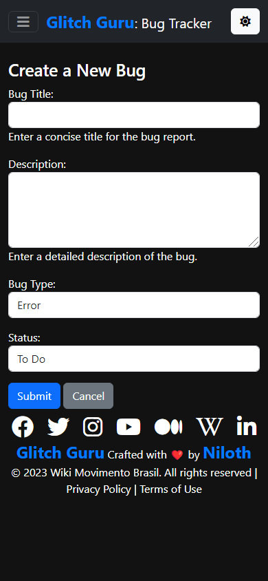

.. _FeaturesForUsers:

Features for Users
---------------------

.. contents:: Table of Contents

User Accessibility
===================

Web Accessibility
~~~~~~~~~~~~~~~~~~~

  - **Readable Fonts and Color Contrast**: Use legible fonts and maintain proper color contrast for accessibility.
  - **Screen Reader Compatibility**: Test and optimize the app for screen readers and other assistive technologies.
  - **Text Alternatives for Images**: Provide descriptive text alternatives for all images and non-text content.
  - **Easy-to-Use Forms**: Design forms that are easy to complete and submit, with proper form labels and input field descriptions, and help texts for every field.
  - **Content Structure**: Implement semantic HTML to create a clear and logical content structure.
  - **Focus on Mobile Responsiveness**: Prioritize mobile responsiveness for an optimal experience on various devices.
  - **Universal Design Principles**: Embrace universal design principles to make the app accessible to everyone. 
  - **Utilizing Semantic Links**: Use semantic links everywhere for enhanced information connectivity

User Convenience Features
==========================

These features have been added for user experience

- **Pagination Feature**: Provides easy navigation with four buttons.

    Pagination buttons

    Dark Theme Form with descriptive fields and a cancel button

- **Dark Theme**: For all the night owls and cool folks :p
- **Form and Admin Interface**:
    - Every field includes descriptive help texts.
    - Utilizes verbose field names for improved readability.
- **Most Recent Issues First**: Issues are sorted in reverse chronological order
- When creating a new issue, users are redirected to the created bug.
- **Cancel Button on Form**: Allows users to easily abort actions without frustration.

    Filters

- **Filtering Options**:
    - Filter issues by issue status.
    - Filter issues by the type of bug report.
- **Search Functionality**: Supports partial match title search.
- **Custom 404 Page**: Provides a reassuring message for lost users and guides them back in a friendly way.
- **Icon Links to WMB**: Engaging and offers quick access to social media links.

    Social Media Icons

- **Welcoming Home Page**: Designed to engage and welcome users.
- **Header and Footer**: Enhances customer engagement through consistent branding.

    The footer in dark theme

- **Documentation Features**:
    - Back to Top Button in RTD Docs: Enhances usability by providing quick navigation to the beginning of the page.
    - Readability: Utilizes different colors for various headings to improve content organization.

    CDN not loading error    

- **Graceful Degradation of errors**: We prioritize graceful degradation in our error handling. This means that even in the face of errors, our application continues to function as expected, providing a better user experience.

    - **Handling CDN URLs not loading errors**: To maintain resilience, we've implemented mechanisms to handle Content Delivery Network (CDN) URL errors. This ensures that our application remains accessible even when external resources face issues.

:ref:`Back to Top <FeaturesForUsers>`
