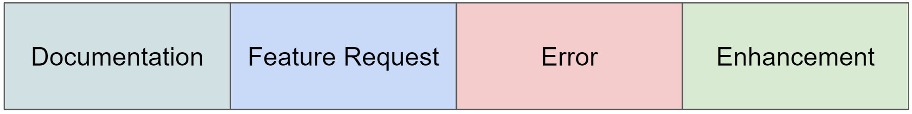
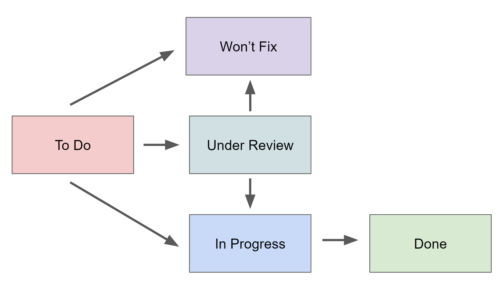

.. _Bugs:

Bugs?
---------

.. contents:: Table of Contents

Bug Definition
==============

In the context of this tool, a "bug" encompasses a broad range of issues, feedback, feature requests, error reports, and any other relevant matters. 
The definition of a bug for this tool is intentionally open and inclusive, allowing for the comprehensive tracking of various types of concerns related to the system. 

Here's the definition:

.. note::
    A "bug" in this tool is any issue, feedback, feature request, or error report that affects the functionality, performance, or usability of the application. 

Bugs can include, but are not limited to:

- **Error Reports**: Issues that result in unexpected behavior, crashes, or system errors.

- **Feature Requests**: Suggestions for new functionalities, enhancements, or improvements to the application.

- **Enhancements**: Non-critical improvements that can enhance the user experience or system efficiency.

- **Documentation Issues**: Problems related to documentation, such as unclear instructions or missing information.

- **User Feedback**: General feedback, comments, or questions from users that provide insights into their experience with the application.

- **Usability Concerns**: Any matters related to the ease of use, navigation, or user interface design.

- **Performance Optimization**: Suggestions or issues related to system performance, responsiveness, or resource usage.

- **Security Concerns**: Reports or concerns about data security, privacy, or potential vulnerabilities.

This open definition of a "bug" ensures that all relevant issues and feedback are captured and can be effectively tracked, managed, and prioritized for the ongoing improvement and development of the tool.

Bug Properties
==============

- **Title**: 
    - The name of the bug report
    - Limits: Up to 255 characters
    - Required

- **Description**:
    - A detailed description of the bug.
    - Size not limited
    - Optional

- **Type**:
    - The nature of the bug report
    - Limits: Up to 20 characters
    - Choices: Error, Feature Request, Enhancement, Documentation
    - Required

- **Report Date**:
    - The date and time when the bug was reported. 
    - Auto-generated at the time of report and cannot be set by the user.

- **Status**:
    - The current status of the reported bug
    - Limits: Up to 20 characters
    - Choices: To Do, In Progress, Done, Under Review, Won't Fix
    - Required

Bug Types
=========

- **Error**: Report issues that cause unexpected errors or problems in the system. It covers issues that need fixing to ensure the application's stability.

- **Feature Request**: Users can use this category to suggest completely new features they'd like to see in the application. It's a way to gather user feedback and prioritize improvements.

- **Enhancement**: Enhancement is for non-critical improvements that can enhance the user experience or make the system more efficient. It includes changes that are not urgent but can provide value.

- **Documentation**: Issues related to documentation, such as missing or unclear instructions, are categorized here. Clear documentation is crucial for user understanding.

Bug Statuses
============

- **To Do**: This status is assigned to new bug reports that haven't been reviewed yet. It represents issues that are in the backlog and waiting for assessment. It ensures that no reported problems are overlooked.

- **In Progress**: Issues in this state are actively being worked on by the development team. It indicates that someone is addressing the problem or implementing the feature, emphasizing active project development.

- **Under Review**: This status is used when an issue is under assessment or review. It's an important phase for evaluating the problem and allowing the team to determine the next steps and priorities.

- **Done**: When a bug is resolved or a feature is implemented, it's marked as "Done." This status indicates that the issue has been successfully addressed and is ready for testing and deployment.

- **Won't Fix**: In some cases, a decision is made not to address a reported issue. "Won't Fix" is used when a problem or feature request is not considered a priority or doesn't align with the project's goals, or is outside the project's scope.

The selected categories and statuses strike a balance between 
addressing critical issues, gathering user feedback, and ensuring efficient project development, 
while still maintaining the simplicity and minimalism.

:ref:`Back to Top <Bugs>`
